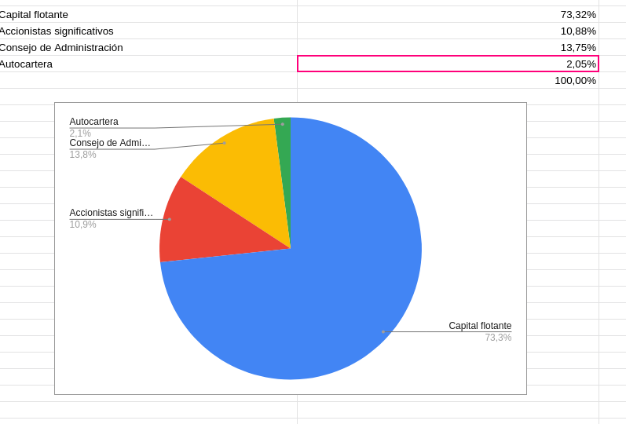

## Pregunta 1
En la introducción del caso sobre el Grupo ACS se dice que la empresa cuenta con  
“una cartera de productos diversificada”.  ¿Podría  explicar  a  qué  se  refiere exactamente  esta  afirmación? 
Explíquelo  como  si  se lo  estuviera  contando  a alguien que NO sabe nada de gestión empresarial.

### Respuesta   

Definción de activos:  Conjutno de bienes y derechos de una sociedad, ie lo que posee más lo que le deben.  (el pasivo sería el conujunto de deudas y obligaciones pendientes de pago, infomaría del origen de lso fondos).   

Definición cartera de valores: Conunto de activos financieros que posee una persona física o jurídica (acciones, bonos, fondos de inversión...)

Diversiciícación de la cartera: componer la crtera con distintos tipos de activos con el objetivo principal de reducier lso riesgos naturales de la inversión. 

#### Bonus de definición   

##### Bono   
Instrumento de deuda que emite una empresa o administración pública para financiarse. 

El emisor de un bono promete devolver el dinero prestado al comprador de ese bono más, normalmetne unos interese fijados previamnete conocideo como cupón.  

#### Fuentes  
- https://www.eleconomista.es/diccionario-de-economia/cartera-de-valores  
- Bono: https://economipedia.com/definiciones/bono.html
-  diversificación de la cartera: https://economipedia.com/definiciones/diversificacion-de-carteras.html

## Pregunta 2  

¿En qué consiste el principio “cumplir o explicar” que se menciona en el texto del caso? 

### Respuesta   

Es un prinicipio de regulación que en vez de imponer leyes establece un código  en el cual aparece una lista con las empresa con las que debe cumplir y en caso de no hacerlo debe dar una explicación pública. 

#### fuentes 
https://en.wikipedia.org/wiki/Comply_or_explain

## Pregunta 3  

¿Qué es el free float o capital flotante? 

### Respuesta   
De origen anglosajón, el free float hace referencia a la cantidad de acciones en circulación de una sociedad cotizada que se encuentran disponibles para su compra a través del mercado. Es decir, el total de acciones menos la porción en manos del grupo dominante y de inversores estratégicos, como pueden ser el Gobierno en el caso de empresas privatizadas, los miembros de la dirección o inversores a largo plazo.

Free float = Acciones en circulación – Acciones Restringidas

De este modo, el concepto de free float puede ser empleado como una medida representativa del tamaño del mercado o, lo que es lo mismo, del valor real de todas aquellas acciones que estén libremente disponibles para su negociación por parte de los inversores. 

https://www.andbank.es/observatoriodelinversor/el-free-float-frente-a-las-acciones-restringidas/

## Pregunta 4   

Represente  en  un  diagrama  de  sectores  o  circular  la  estructura  de  capital  del Grupo ACS. ¿Es una estructura de capital concentrada o dispersa?

  
https://docs.google.com/spreadsheets/d/1k-zbsb1iN8ChYxeI_XcUU_sSfmWI4YgQ_VV-qxekLCY/edit?usp=sharing

Tiene una estrucuta dispersa

## Pregunta 5  

¿Qué es la autocartera? ¿Cuáles son sus objetivos?

### Respuesta   

Es el número de acciones propias que una empresa se reserva para sí mismo ara :  

- Evitar posibles especulacionse que se deriven en el hundimiento del valor de mercado de los títuos de la sociedad en enternos empresariales hostiles.  

- Optar por una forma de retribución en forma de acciones para sus directivos y empleados.  

https://www.elblogsalmon.com/conceptos-de-economia/que-es-la-autocartera

## Ejercicio 6  

Explique las principales diferencias entre los tipos de consejeros que existen en el consejo de administración del Grupo ACS (véase Figura 1.2. columna “tipo de consejero”).

### Respuesta  

#### Ejecutivo 

Miembros del consejo que poseen funciones ejecutivas y directivas en la sociedad y mantienen una relación contractual con la misma. Por regla general, poseen un perfil técnico relacionado con sus labores de dirección. El ejemplo más claro es el del consejero delegado, un alto directivo de la sociedad con funciones ejecutivas, las cuales ejerce bajo la supervisión del propio consejo, y en quien se delegan algunas de sus facultades.

#### Consejeros dominicales  

Miembros del consejo que acceden al mismo por ser titulares o representar a titulares de paquetes accionariales con capacidad de influir por sí solos, o por acuerdos con otros, en el control de la sociedad. Es decir, se hayan vinculados al accionista o grupo de accionistas de control (accionistas significativos).

#### Consejeros independientes  
Miembros del consejo no vinculados con el equipo de gestión de la sociedad ni con sus accionistas de control, que acceden al mismo por sus conocimientos técnicos y su experiencia profesional. Por tanto, este tipo de consejero se elige en base a sus circunstancias personales y profesionales, con los objetivos de lograr una visión externa e independiente y defender los intereses de todos los accionistas, fundamentalmente de los minoritarios.

La composición que adopte en la práctica el consejo de administración de una sociedad suele depender mucho de su tamaño. De este modo, en las pymes es difícil encontrar consejeros independientes, que sí son habituales en las grandes empresas. No obstante, contar con su opinión y experiencia puede ser muy beneficioso para una sociedad, sobre todo, cuando ésta empieza a tener cierta dimensión (estoy pensando en medianas empresas). No es raro encontrar compañías que “mueren de éxito” cuando crecen, con la aparición de disputas en el seno de su consejo de administración, que no pueden resolverse con facilidad precisamente por no contar con el equilibrio que aportan voces independientes. El reto aquí es encontrar consejeros que verdaderamente sean independientes de quienes los nombran, y eso, en cualquier caso, no parece fácil de conseguir.

otra definición: 

Un consejero independiente es un miembro más del Consejo de Administración que no forma parte del equipo de gestión ni tiene relación con los accionistas principales de la sociedad. Esta persona se elige para defender los intereses de todos los accionistas, y en particular de los minoritarios que no tienen acceso a un puesto en el Consejo. Según la CNMV, este perfil es especialmente relevante en situaciones de conflicto potencial (operaciones vinculadas, OPA, fusiones, accionistas minoritarios, empresas familiares, etc.).

El perfil seleccionado debe reunir una serie de cualidades que junto a su experiencia y prestigio profesional le definan como un candidato cualificado para defender los intereses de los accionistas que no estén presentes en el Consejo. La CNMV aconseja que se seleccionen profesionales procedentes de diversos sectores o negocios para enriquecer con puntos de vista diferentes y con la aportación de experiencias diversas, incluso procedentes de ámbitos ajenos a la actividad de la empresa.

#### Consejero otro externo   

Miembro del Consejo de Administración que no interviene en la actividad diaria de la sociedad; puede ser dominical o independiente. Ver CONSEJERO DOMINICAL y CONSEJERO INDEPENDIENTE.

http://www.gestoresderiesgo.com/colaboradores/los-tres-tipos-de-consejeros-en-los-consejos-de-administracion

https://www.deliciascapital.com/consejero-independiente/

https://www.eleconomista.es/diccionario-de-economia/consejero-externo

## Ejercicio 7  

¿Qué es un consejero delegado CEO? ¿En qué se diferencia del resto de consejeros? 

### Respuesta   

El consejero delegado es un miembro del “Consejo de administración” de una sociedad anónima o limitada, al que el propio Consejo acuerda que se le deleguen ciertas facultades de gestión y/o representación.

https://asepyme.com/consejero-delegado-obligaciones-funciones-facultades/

1. Cargo y persona en la que se delegan casi todas las atribuciones del consejo de administración, previa aprobación por mayoría de dos tercios de sus componentes. A veces utilizan incorrectamente este nombre el o los administradores únicos. En las grandes empresas se utiliza en ocasiones para cubrir un nivel del escalafón y entonces se hace compatible con el cargo de 'presidente ejecutivo' o 'director general'.

https://www.expansion.com/diccionario-economico/consejero-delegado-ceo.html

## Ejercicio 8  

¿En  qué  se  diferencian  las  funciones  de  un  presidente  del  consejo  de administración de las funciones de un consejero delegado?

### Respuesta   

La diferencia entre CEO y COB

El CEO dirige los aspectos operativos de una empresa; el consejo de administración supervisa la empresa en su conjunto, mientras que el líder del consejo se llama presidente del consejo (Chairman of the Board) (COB). La junta tiene el poder de anular las decisiones del CEO, pero el presidente de la junta no tiene el poder de anular la junta. En cambio, el presidente se considera un par con los otros miembros de la junta. En algunos casos, el CEO y el presidente de la junta pueden ser la misma persona, pero muchas compañías dividen estos roles entre dos personas.
http://www.muyfinanciero.com/conceptos/ceo-y-presidente/
